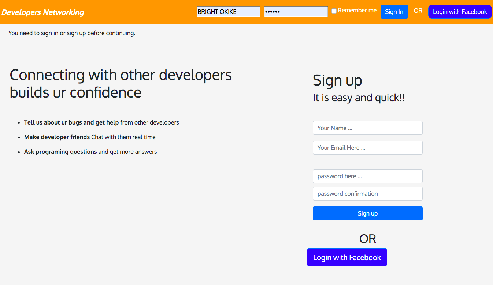

<h1 align=center> **Developer Connect** </h1>

[](https://github.com/RichardLitt/standard-readme)
[](https://david-dm.org/dwyl/esta)


This is project was built to mock some functions stack overflow website with additional feature where developers can search for other developers, send and receive friend request, chat realTime with developer friends, ask questions, answer questions, like a question or an answer. 




## Background

- Ruby
- Rails
- Javascript
- Jquery
- SCSS
- Bootstrap 


## Demo
 Check out the live demo of the project. [Click](https://facebook-clone3.herokuapp.com/)

## Usage

```sh
$ git clone https://github.com/macbright/facebook-clone.git myproject
```
<br /> Clone the repository to your local machine


```sh
$ cd myproject
```
<br /> cd into the directory


```sh
$ apt install redis-server  OR brew install redis
```
 to install redis-server. i used redis both for the development and production ActionCable adapter. 


`$ bundle install` 
<br /> to install all the gems

`$ rake db:migrate` 
<br /> to migrate the database

`$ redis-server /usr/local/etc/redis.conf` <br/> to start up the redis server. you have to start the redis server before starting up the rails server

`$ rails server` 
<br /> to start rails server


## Maintainers 

👤  **Bright Okike**

- Github: [@macbright](https://github.com/macbright)
- LinkedIn: [@bokike](https://www.linkedin.com/in/bokike/)
- Twitter: [@b_okike](https://twitter.com/b_okike)

## Future Features
1. convert the app into a single page app using Rails API at the backend and React & Redux at the frontend. 

2. add admin session to the app


## Contributing

1. Fork it https://github.com/macbright/facebook-clone.git/fork)
2. Create your feature branch (git checkout -b feature/[choose-a-name])
3. Commit your changes (git commit -am 'What this commit will fix/add')
4. Push to the branch (git push origin feature/[chosen name])
5. Create a new Pull Request

## License

Bright okike
[MIT license](https://opensource.org/licenses/MIT).